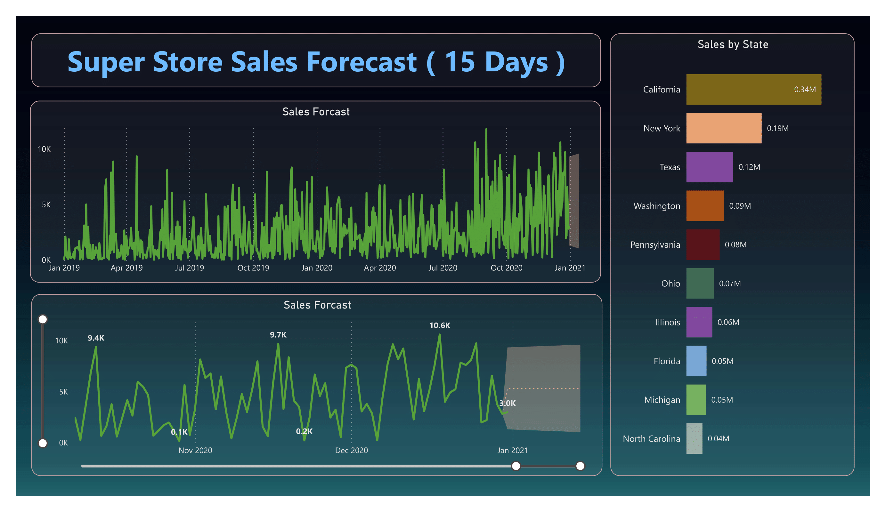

# Super Store Sales Analysis with Power BI

This project encompasses robust data analysis techniques, particularly focusing on time series analysis. By leveraging these methods, the objective is to provide valuable insights, precise sales forecasting, and an interactive dashboard crucial for enhancing business success.

## Dashboard Preview

For an overview of the project's dashboard, you can refer to the following screenshots:

### [Dashboard Preview 1](Super_Store_Sales_Analysis-1.png)

### [Dashboard Preview 2](Super_Store_Sales_Analysis-2.png)

Please note that for a detailed exploration and interaction with the dashboard, refer to the accompanying [Super_Store_Sales_Analysis.pdf](Super_Store_Sales_Analysis.pdf) file.
